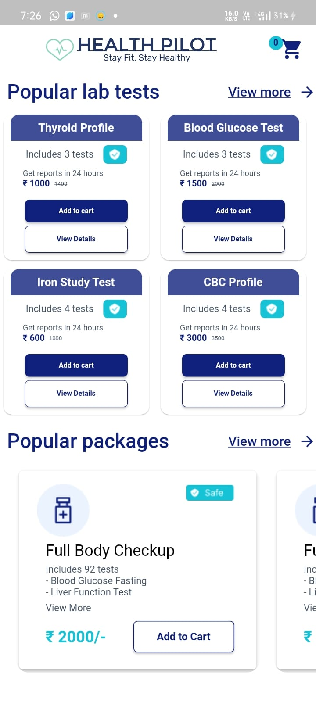
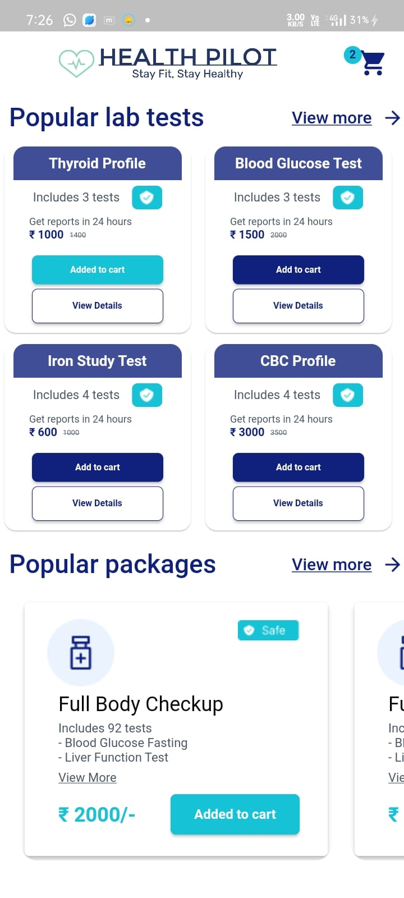
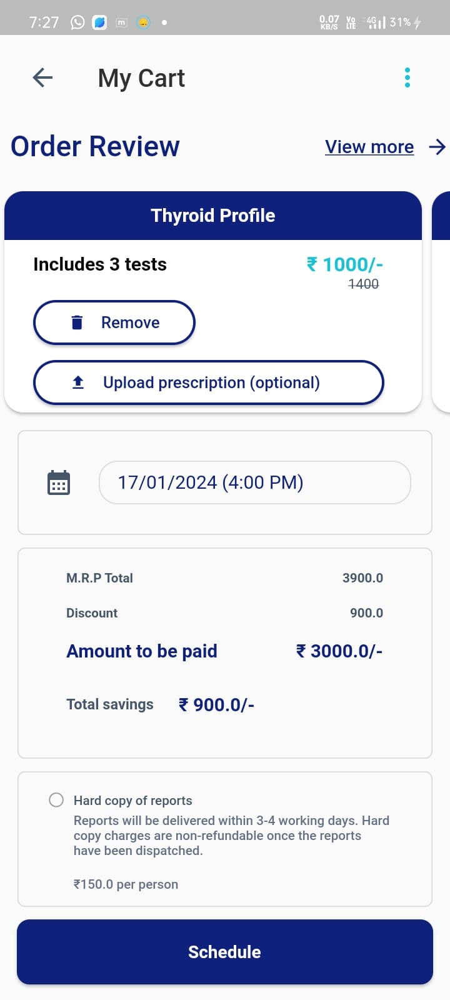
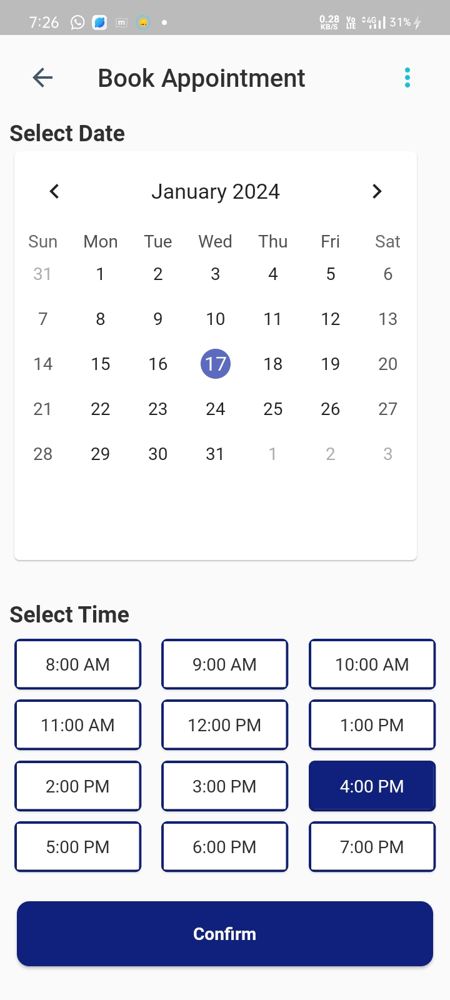
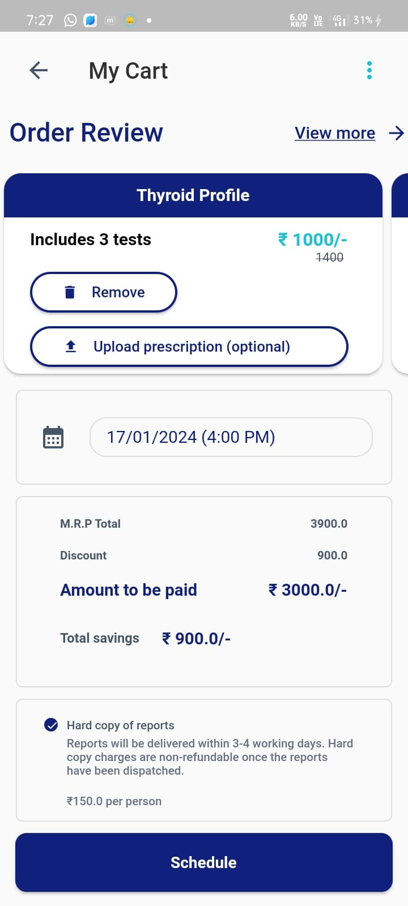
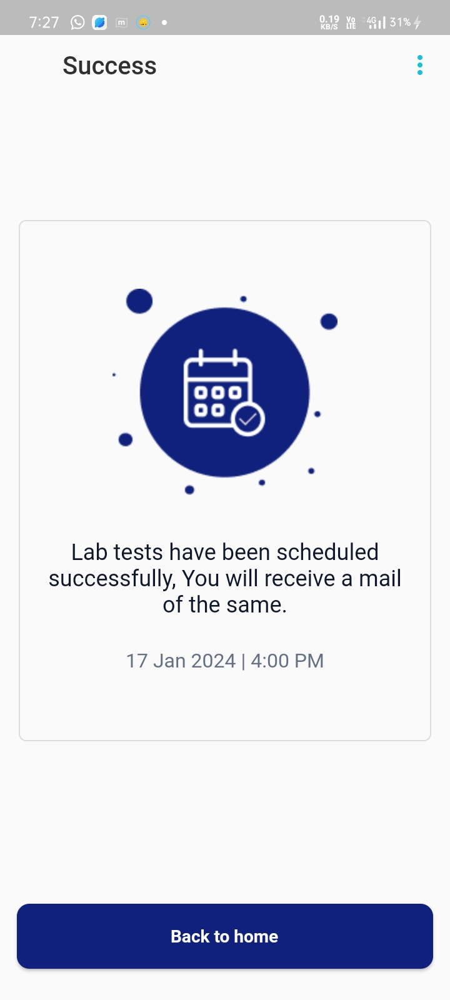

# 🧪 Health-Pilot Flutter Application

Health Pilot is a scalable and modular mobile application for booking lab tests and managing reports. It leverages a microservices-based backend with secure user authentication, a dynamic test catalog, and intelligent recommendations, all integrated into a seamless Flutter frontend.

---

## 🚀 Recent Features Implemented

✅ **Backend Microservices Development (Node.js + Express.js):**

- Built key **microservices** for booking lab tests with **MySQL transactions** to ensure data consistency and concurrency handling.
- Designed and implemented a **Cart Service** to allow users to add, view, and manage lab tests before booking.
- Created a **Test Catalog Service** to fetch and display lab tests dynamically via the Flutter frontend.
- Integrated a **locally hosted LLaMA LLM** for recommending tests based on user symptoms (internal API-based).
- Implemented **secure user authentication and registration** using **JWT**, **bcrypt** for password encryption, and **Redis** for session storage.
- Enabled secure **PDF lab report viewing** using **Supabase** object storage and `flutter_cached_pdfview`.

✅ **Microservice Design Principles:**

- Followed **clean microservice structure** ensuring clear separation of concerns, modularity, and scalability.
- Implemented **internal APIs**, session caching, and future-ready Kafka event bus stubs.

✅ **Frontend (Flutter):**

- Built using **CLEAN architecture** and **Provider** for state management.
- Implemented UI for **popular lab tests**, **packages**, **cart handling**, and **appointment booking**.
- Integrated REST APIs using `dio`, and displayed lab reports securely.

---

## 🧰 Technologies Used

**Backend:**  
`Node.js`, `Express.js`, `MySQL`, `Redis`, `Supabase`, `Kafka (partial)`, `bcrypt`, `JWT`, `LLaMA`, `PDFKit`

**Frontend:**  
`Flutter`, `Provider`, `dio`, `flutter_cached_pdfview`

---

## 📱 App Features

1. Displaying Popular Lab Tests  
2. Displaying Popular Packages  
3. Cart Feature (Add/Remove Lab Tests)  
4. Book Appointment Functionality  
5. Secure Viewing of Lab Reports

---

## 🛠️ Key Concepts Implemented (Frontend)

- CLEAN Architecture  
- Provider State Management  
- DRY Principle  
- Responsive UI  
- REST API Integration  
- Secure Authentication (Planned Firebase/Future OAuth)

---

## 🧠 System Architecture

The following is a **future-scalable system architecture** designed to handle large traffic, modular functionality, and AI-powered features. Not all components are currently implemented, but this reflects my understanding of scalable system design and my roadmap for evolving the platform.

> 🔍 **Note**: This diagram reflects my long-term vision for this application. While some parts like Kafka-based communication, complete LLM integration, and distributed caching are not fully implemented, this demonstrates my ability to visualize, plan, and build scalable systems — and I'm continuously working to implement more features.

---

## 🖼️ Sample UI Screenshots

<table>
  <tr>
    <td></td>
    <td></td>
  </tr>
  <tr>
    <td></td>
    <td></td>
  </tr>
  <tr>
    <td></td>
    <td></td>
  </tr>
</table>

---

## 📈 Learnings and Future Scope

- Learned to build clean and modular **Node.js microservices**
- Gained hands-on experience with **JWT-based authentication**, **Redis**, and **Supabase**
- Understood **event-driven architecture** and explored **Kafka** for async task handling
- Designed and integrated an **LLM-powered suggestion system** using internal APIs
- Practiced **frontend-backend integration** using **Flutter + REST APIs**

### 🛤️ Planned Improvements

- Complete Kafka-based async event flow  
- Admin Dashboard for lab owners  
- Full test report analytics  
- SMS/Email notifications via Kafka events  
- Monitoring and logging (Prometheus, Grafana)

---

> 🔗 *This project helped me bridge the gap between frontend, backend, and system design — giving me a full-stack perspective with a strong foundation in scalable architecture.*
